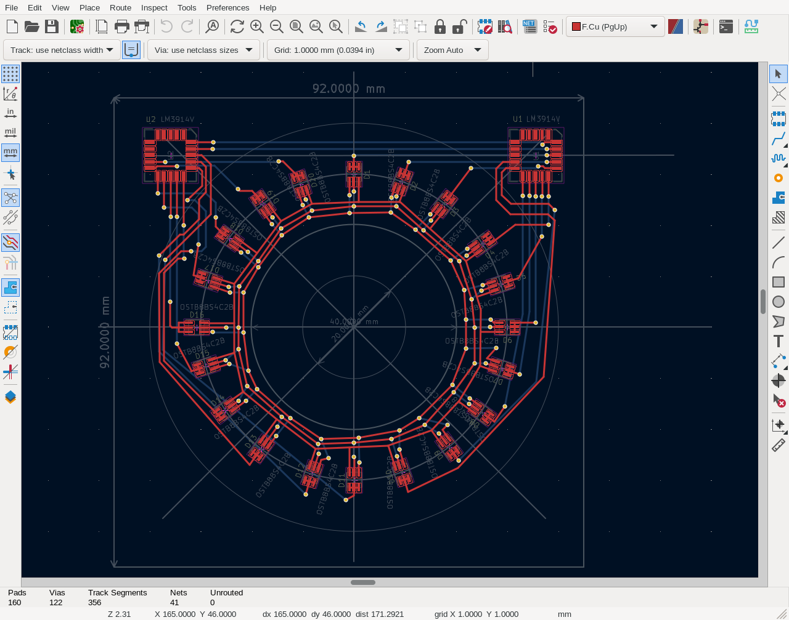

[NOTE]
This is Work In Progress

LED ring, to show volume knob position or else.

Features:

 * Analog input, +- 10V
 * Clock-less operation. That is, no clocks, even within the chips.
   This is a good for audio prosumer and hi-fi uses,
   or any other uses where noise emission is to be kept low,
   e.g. Frequency knob of HAM radio VFO.
 * Multi-colour variant
 * Relatively cheap to build.

As stated in the top note, the project is Work In Progress.
That is, there is no physically built prototype yet.

The clock-less operation is achieved by use of LM3914 chips.
Each can control 10 LEDs, two can control 20 LEDs with 20 step resolution.
Another set of window comparators is to be used for changing the color
at specific positions.

The aimed design is with DIP variant of the LM3914 chip, as it is
(currently and fortunately) relatively cheap and easy to assemble in
small volumes by human with some soldering skills. PCBs of an SMD
design variant of the same schematics are usually populated by
specialized machines, but with some skill the PCB can be populated
with manually by humans too.

Tools:

 * KiCAD - schematics and PCB design
